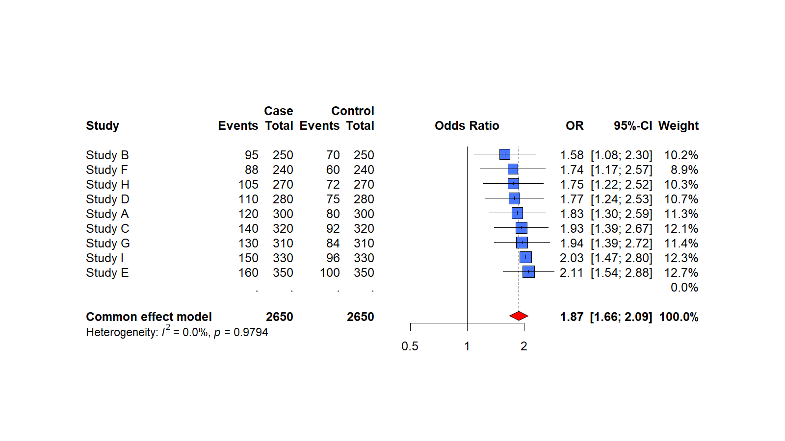
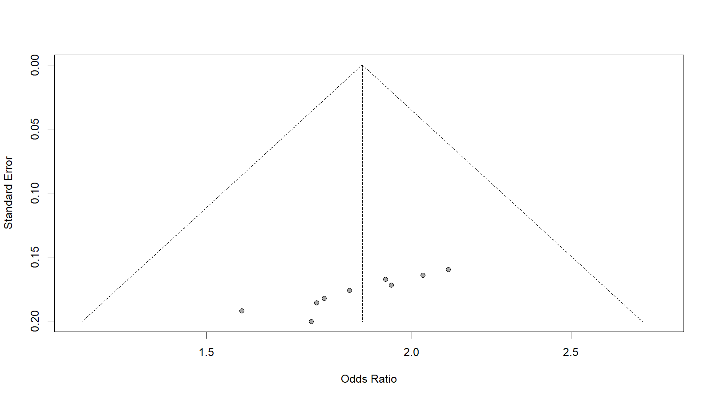

# cancer-risk-meta-analysis
Reproducible R-based meta-analysis of case-control studies assessing the association between incense smoke exposure and lung cancer risk.

# Cancer Risk Meta-Analysis in R

## Overview

This project presents a reproducible R-based workflow for conducting meta-analysis on case-control study data. It demonstrates end-to-end analysis including data preparation, effect size estimation using the Mantel–Haenszel method, visualization through forest and funnel plots, and assessment of publication bias.

The project is designed to reflect practical workflows used in biomedical research and data analysis settings.

---

## Key Features

* Implementation of Mantel–Haenszel meta-analysis for binary outcomes
* Generation of publication-quality forest plots and funnel plots
* Assessment of heterogeneity and pooled effect size
* Publication bias evaluation using Egger’s test
* Structured, reproducible project workflow

---

## Methodology

* Study-level case-control data were imported from CSV format
* Odds ratios were computed and pooled using fixed and random effects models
* Heterogeneity was assessed using standard meta-analysis statistics
* Forest plots were generated to visualize individual and pooled effects
* Funnel plots and Egger’s regression test were used to explore publication bias

---

## Tools & Technologies

* **R**
* `meta` package for statistical analysis
* Base R plotting functions for visualization

---

## Project Structure

```
cancer-risk-meta-analysis/
├── data/        # Input dataset
├── scripts/     # Analysis scripts
├── outputs/     # Generated plots and results
├── report/      # Project summary
└── README.md
```

---

## How to Run

```r
source("scripts/01_load_packages.R")
source("scripts/02_run_meta_analysis.R")
source("scripts/03_publication_bias.R")
```

---

## Results

### Forest Plot



### Funnel Plot



---

## Key Insights

The analysis demonstrates how meta-analysis can be applied to synthesize evidence across multiple studies. The pooled effect size indicates a consistent direction of association across studies, while visualization techniques provide insight into heterogeneity and potential publication bias.

---

## Portfolio Relevance

This project highlights:

* Practical application of statistical methods in biomedical research
* Ability to structure and document reproducible data analysis workflows
* Experience with R-based analytical pipelines
* Clear communication of analytical results

---

## Notes

This repository uses a simplified dataset for demonstration purposes and is intended as a portfolio project.

---

## Author

Hui Wen Tang
Bioinformatics & Data Analysis
